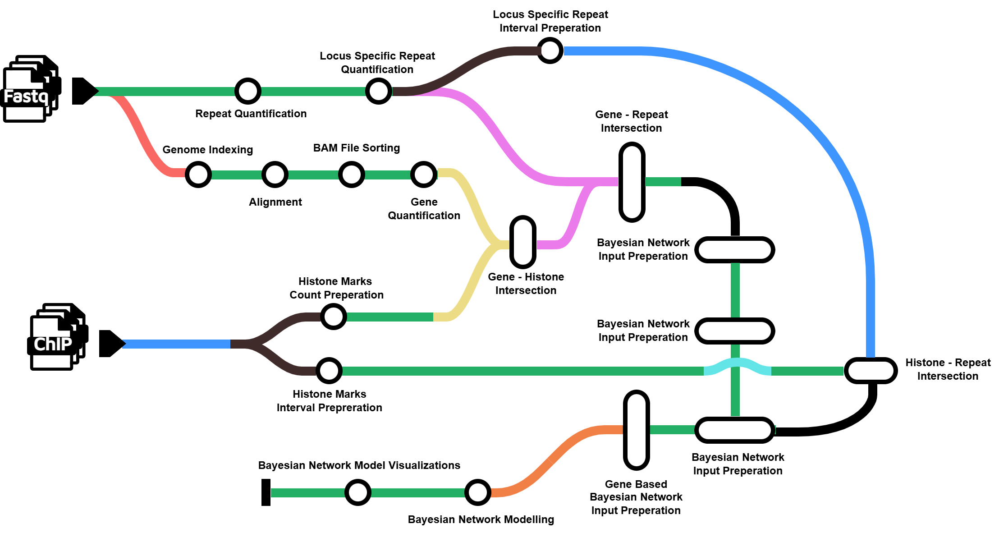

# TEffectBayes: A Bayesian Workflow for Multi-Omic Analysis of Gene, Repeat, and Histone Interactions

**TEffectBayes** is a modular Nextflow pipeline designed to integrate **RNA-Seq** and **ChIP-Seq** data in a unified framework to model the regulatory landscape of genes, histone modifications and transposable elements (TEs). By quantifying expression and occupancy patterns of genes, TEs, and histone marks, and performing **Bayesian Network Modeling**, the pipeline infers regulatory relationships within and across omic layers.

This pipeline is particularly suited for studies aiming to:

- Understand how histone modifications and TE activity influence gene expression

- Explore cell-type or condition-specific regulatory networks

- Integrate multi-omic signals into a unified causal framework

- Generate interpretable graphical models to guide hypotheses about gene regulation



---
# Pipeline Summary

**TEffectBayes** includes a comprehensive pipeline that contains several processing steps to integrate regulatory elements obtained from different multi-omic data. These steps are as follows:

**1. STAR_GENOMEGENERATE :** Generates genome indices from the reference FASTA and GTF files for STAR alignment.

**2. STAR_ALIGN :** Aligns RNA-seq FASTQ reads to the indexed genome using the STAR aligner.

**3. SAMTOOLS_SORT :** Sorts STAR-aligned BAM files to prepare for downstream quantification.

**4. featureCountsR :** Quantifies gene expression using featureCountsR and creates required input tables for following integration steps.

**5. salmonTE_quant :** Estimates TE expression from RNA-seq reads using SalmonTE.

**6. locus_quant :** Aggregates expression estimates at repeat loci from family level quantification abundance of salmonTE output.

**7. locus_interval_prep :** Converts quantified repeat loci into BED interval formats for overlap analysis.

**8. histone_count_prep :** Prepares histone signal count matrices across all samples for downstream merging. 

**9. histone_interval_prep :** Prepares histone intervals across all samples for downstream merging.

**10. gene_histone_intersection :** Uses BEDTools and pybedtools to intersect gene regions with histone marks.

**11. repeat_histone_intersection :** Uses BEDTools and pybedtools to intersect TE regions with histone marks.

**12. repeat_gene_intersection :**
1. gene_repeat_intervals : Used for creating TE and gene regions interval bed files required for intersect analysis.
2. BEDTOOLS_INTERSECT : Uses BEDTools to intersect gene regions with TE regions.

**13. BNM_INPUT_PREP :**
1. BNM_INPUT_PREP_STEP1 : Transforms the initial gene, TE intersection and creates it initial input files required for bayesian network analysis.
2. BNM_INPUT_PREP_STEP2 : Further transforms the input based on biological condition groups.
3. BNM_INPUT_PREP_STEP3 : Performs a merging to detect overlapping histone-repeat couples with the main input files.
4. BNM_INPUT_PREP_STEP4 : Creates gene input tables from the main input file.

**14. BNM_CALCULATION :** Performs Bayesian Network model and creates regulatory model per gene.

**15. BNM_INFERENCE :** Performs the Bayesian Inference of the regulatory network per gene.

**16. BNM_VISUALIZATION :** Generates graphical representations of inferred networks.

---

# Usage

This repository supports containerized execution via Docker, ensuring consistent and reproducible runs without requiring users to manually install any bioinformatics tools or software dependencies. Instead of a single custom Docker image of the entire workflow, the TEffectBayes pipeline uses the -profile docker option in Nextflow, which automatically pulls the appropriate Docker container for each module. This modular containerization ensures flexibility and compatibility across diverse tasks such as alignment, quantification, peak annotation, and Bayesian modeling.

Before running the pipeline, prepare the necessary RNA-seq and ChIP-seq samplesheets. These files define the structure and metadata for your input data. These input data should look as follows:

samplesheet.csv:

    sample,fastq_1,fastq_2,condition,cell_line
    sample1,data/sample1_R1.fastq.gz,data/sample1_R2.fastq.gz,treatment,MCF10A
    sample2,data/sample2_R1.fastq.gz,data/sample2_R2.fastq.gz,control,MCF7
    sample3,data/sample3_R1.fastq.gz,,control,MCF7

Each row in the  samplesheet.csv represents a fastq file (single-end) or a pair of fastq files (pair-end) for RNA-seq samples. Rows with the same sample identifier are considered technical replicates and merged automatically. The condition and cell_line columns are required for the bayesian network analysis steps.

samplesheet_chip.csv:

    feature_counts,annotation,antibody
    data/K27me3.consensus_peaks.featureCounts.txt,data/K27me3.consensus_peaks.annotatePeaks.txt,K27me3
    data/K4me3.consensus_peaks.featureCounts.txt,data/K4me3.consensus_peaks.annotatePeaks.txt,K4me3
    data/K9ac.consensus_peaks.featureCounts.txt,data/K9ac.consensus_peaks.annotatePeaks.txt,K9ac

The feature_counts column should contain output from feature quantification tools (e.g., featureCounts). The annotation column should contain peak annotations, such as those generated by HOMER’s annotatePeaks.pl. The antibody column specifies the histone mark used for the ChIP-seq experiment. These input files can be produced using pipelines like nf-core/chipseq or generated manually using standard tools in the pipeline.

To run the pipeline, ensure that Nextflow and Docker are installed on your system.
1. Install Docker and Nextflow if not already available: https://docs.docker.com/get-docker https://www.nextflow.io/docs/latest/install.html
2. Clone the repository:

```
git clone https://github.com/nkaan-kutlu/TEffectBayes.git
cd /TEffectBayes
```

Then, you can run the pipeline with following command:

```
nextflow run main.nf  --input <SAMPLESHEET> \
    --input_chip <SAMPLESHEET_ChIP> \
    --outdir <OUTDIR> \
    --repeat <REPEAT GTF> \
    --genome <GRCh38/GRCm38/hg19/mm10>\
    -profile <docker>
```

Alternatively, you can use Conda profile for managing the environment with the following command:

```
nextflow run main.nf  --input <SAMPLESHEET> \
    --input_chip <SAMPLESHEET_ChIP> \
    --outdir <OUTDIR> \
    --repeat <REPEAT GTF> \
    --genome <GRCh38/GRCm38/hg19/mm10>\
    -profile <conda>
```

However, using the Docker profile is recommended for flexible operation and compatibility across different tasks. If you prefer not to use Docker or Conda you can still run the pipeline, but the required tools must be pre-installed on your system.

For additional information or to see all available options and parameters for the pipeline, you can use the --help flag when running the pipeline. This will display a detailed list of all configurable parameters and their default settings.

To view the help documentation, run:
`nextflow run main.nf --help`

Refer to this output for customization options and to better understand how to adjust the pipeline to your specific needs.

To verify that the pipeline is set up correctly and functioning as expected, TEffectBayes also includes a complete set of test data located in the tests/ directory of the repository. This test suite allows users to perform a quick, lightweight run of the workflow for validation.

The test data includes:

- Dummy RNA-seq fastq files and ChIP-seq count matrices
- A small repeat and gene annotation GTF file
- A small reference genome in FASTA format

You can run the test configuration using the following command:
`nextflow run main.nf -profile test`

This will execute the pipeline end-to-end using minimal resources and time, making it ideal for setup validation.

---
# Pipeline Output

After a successful run, TEffectBayes organizes all results in the directory specified by --outdir. Each module produces structured outputs that are easy to trace and interpret. Below is a detailed description of what each step generates:

## Star GenomeGenerate
This step produces the STAR genome index files required for alignment. These include Genome, SA, and SAindex, along with STAR's parameter report.

## Star Align
RNA-seq reads are aligned to the indexed genome using STAR, resulting in unsorted BAM files for each sample. Additional logs such as Log.final.out and Log.progress.out are also produced. 

## Samtools Sort
The aligned BAM files are sorted using SAMtools. This step generates sorted BAM files and their accompanying index files (.bam.bai), which are essential for downstream quantification.

## featureCountsR
Gene-level expression quantification is performed using featureCountsR. Following quantification, the count matrix is annotated using gene IDs from the input GTF file. Raw counts are then normalized to adjust for differences in sequencing depth and library size, allowing fair comparison across samples. Lastly, the normalized count table is reshaped so that each row corresponds to a single gene-sample pair. This long-form table is used in downstream integration steps for gene, repeat, and histone analysis.

<pre><code>| gene_id | gene_name |   gene_type   | seqnames |  start |   end  | width | strand |  sample |  FPKM  |
| GENE001 |   GeneB   | protein_coding|   chr17  | 7565097| 7590856| 25760 |    +   | sample1 |  14.21 |
| GENE001 |   GeneB   | protein_coding|   chr17  | 7565097| 7590856| 25760 |    +   | sample2 |  12.87 |
| GENE002 |   GeneB   | protein_coding|   chr7   | 5527003| 5534567| 7565  |    -   | sample1 |  98.50 |
| GENE002 |   GeneB   | protein_coding|   chr7   | 5527003| 5534567| 7565  |    -   | sample2 | 102.74 | 
</code></pre>

## salmonTE_quant 
TE expression is quantified from RNA-seq reads using SalmonTE. The output is a table listing expression levels for each TE family across all RNA-seq samples.

## locus_quant
SalmonTE family-level quantifications are aggregated at the individual locus level. The result is a locus-level expression table that includes chromosome coordinates, TE family names, and counts for each sample. Then these tables are united into a long-form table similar to gene expression table acquired at the previous process.

 <pre><code>| repeat_id |  TPM | sample  | seqnames | strand | start |  end  | family_id | class_id | width |
| REPEAT001 | 3.52 | sample1 |   chr1   |    +   | 10500 | 10800 |    SINE   |    Alu   |  301  |
| REPEAT001 | 2.98 | sample2 |   chr1   |    +   | 10500 | 10800 |    SINE   |    Alu   |  301  |
| REPEAT002 | 8.43 | sample1 |   chr2   |    -   | 202300| 202700|    LINE   |    L1    |  401  |
| REPEAT002 | 7.91 | sample2 |   chr2   |    -   | 202300| 202700|    LINE   |    L1    |  401  | 
</code></pre> 

## locus_interval_prep
Repeat locus interval files are created based on the quantification table separately for every cell line, which are used in subsequent overlap analyses.

## histone_count_prep
The histone_count_prep step produces histone modification count tables for each ChIP-seq dataset. This process begins by parsing the raw count input from tools such as featureCounts, alongside peak annotation files. For each histone mark (e.g., H3K27me3, H3K9ac), the counts are normalized to Reads Per Million (RPM) to account for library size differences. The annotated peaks are matched to genomic features, and the resulting table is reformatted into a long format, making it consistent with the gene and repeat quantification tables. This format facilitates downstream integration and modeling steps by ensuring each row represents a single histone occupancy signal at a specific genomic locus for a given cell line.

<pre><code>| Gene Name |  Chr |  Start |    End   | Strand | Length | cell_line | histone_rpm |
|   GeneA   | chr12| 6533450 | 6533790 |    +   |   341  |    MCF7   |    5.32     |
|   GeneA   | chr12| 6533450 | 6533790 |    +   |   341  |   MCF10A  |    4.98     |
|   GeneB   | chr7 | 5566700 | 5567100 |    -   |   401  |    MCF7   |    8.21     |
|   GeneB   | chr7 | 5566700 | 5567100 |    -   |   401  |   MCF10A  |    7.89     | </code></pre>

## histone_interval_prep
Histone modification peaks interval files are created based on the quantification table separately for every antibody, which are used in subsequent overlap analyses.

## gene_histone_intersection
In the gene_histone_intersection step, upstream promoter regions of genes are intersected with histone modification peaks. Using genomic range overlap methods, such as BEDTools and pybedtools, the pipeline calculates the overlap between these promoter regions and histone modification peaks (e.g., H3K4me3, H3K9ac, H3K27me3). For each sample, if there is any overlaps between promoter region and histone modification the corresponding histone signal is is added to the gene count table.

<pre><code>| gene_id | sample | FPKM | Chromosome | width | Strand | gene_type      | gene_name | Start | End | cell_line | Histone_Element1| Histone_Element2| Histone_Element3| 
| GENE001 | sample1| 12.5 |   chr1     |  2000 |    +   | protein-coding |   GeneA   | 1500  | 3500|   MCF10A  |      2.3        |       1.5       |       4.0       |
| GENE002 | sample2| 8.9  |   chr2     |  2500 |    -   | protein-coding |   GeneB   | 5000  | 7500|   MCF7    |      1.2        |       2.0       |       3.5       | 
| GENE001 | sample3| 5.1  |   chr3     |  1500 |    +   |   non-coding   |   GeneA   | 1200  | 2700|   MCF10A  |      3.0        |       2.3       |       5.2       |</code></pre>

## repeat_histone_intersection
In the repeat_histone_intersection step, the goal is to identify overlaps between transposable element (TE) regions and histone-modified regions across different cell lines and antibody-specific histone marks. This step starts by generating BED files for both TE loci and histone-modified regions for each cell line and histone antibody (such as H3K4me3, H3K9ac, H3K27me3, etc.).

For each sample, the relevant TE intervals are obtained from the locus quantification step, while histone-modified regions are derived from the histone interval preparation step. The genomic intervals for both TEs and histone marks are represented in BED format, containing information such as chromosome coordinates, strand, start, and end positions.

Using BEDTools and pybedtools, overlapping intervals between the TEs and histone modifications are determined. This analysis helps identify regions where TEs coincide with specific histone marks, providing insights into how TE activity might be regulated or linked to specific histone modifications in different cell types or conditions.

<pre><code>| gene_id | sample | FPKM | Chromosome | width | Strand | gene_type      | gene_name | Start | End | cell_line | Repeat_Element_ID| Repeat_Element_Count| 
| GENE001 | sample1| 12.5 |   chr1     |  2000 |    +   | protein-coding |   GeneA   | 1500  | 3500|   MCF10A  |     REPEAT001    |         1.5         |
| GENE002 | sample2| 8.9  |   chr2     |  2500 |    -   | protein-coding |   GeneB   | 5000  | 7500|   MCF7    |     REPEAT001    |         1.5         | 
| GENE001 | sample3| 5.1  |   chr3     |  1500 |    +   | protein-coding |   GeneA   | 1200  | 2700|   MCF10A  |     REPEAT002    |         1.5         |</code></pre> 

## repeat_gene_intersection
In the repeat_histone_intersection step, transposable element (TE) regions that overlap with the promoter regions (or other gene regions) are combined with the gene-histone count table. First, BED files are generated for both TEs and gene histone regions. These BED files describe the genomic coordinates of both the TEs and the relevant promoter regions. Afterward, BEDTools intersect is used to detect overlapping regions between the TEs and promoters. The overlap information is then used to update the gene-histone count table by adding the counts of TEs that overlap with these promoter regions.

<pre><code>| gene_id | sample | FPKM | Chromosome | width | Strand | gene_type      | gene_name | Start | End | cell_line | Histone_Element1| Histone_Element2| Histone_Element3| Repeat_Element |
| GENE001 | sample1| 12.5 |   chr1     |  2000 |    +   | protein-coding |   GeneA   | 1500  | 3500|   MCF10A  |      2.3        |       1.5       |       4.0       |       5        |
| GENE002 | sample2| 8.9  |   chr2     |  2500 |    -   | protein-coding |   GeneB   | 5000  | 7500|   MCF7    |      1.2        |       2.0       |       3.5       |       3        |
| GENE001 | sample3| 5.1  |   chr3     |  1500 |    +   | protein-coding |   GeneA   | 1200  | 2700|   MCF10A  |      3.0        |       2.3       |       5.2       |       0        |</code></pre>

## BNM_INPUT_PREP
This multi-part step prepares the input tables necessary for Bayesian Network Modeling. The goal is to create a comprehensive table that integrates gene, transposable element (TE), and histone data for each sample, cell line, and biological condition. Here's a detailed breakdown of each sub-step:

- Step 1: This step begins with a long-format input table where each row corresponds to a single gene–TE overlap. Each row contains associated expression values such as gene FPKM and TE TPM and other metadata information. To prepare this data for downstream modeling, the table is transformed into a wide-format, where each row now represents a single gene, and columns are populated with TEs that overlap that gene. For each overlapping TE, its expression (TPM) and related metadata are retained. This format allows for a compact view of all TEs potentially regulating or associated with each gene and sets up the structure for integrating histone-TE overlaps information in later steps.

- Step 2: After transforming the repeat–gene relationships into a wide-format table in Step 1, Step 2 reorganizes this unified table by cell line metadata. For each biological group, a subset of the full input matrix is extracted, ensuring that only samples relevant to that condition are included. This reorganization is essential to accurately integrate histone–repeat information in the following step, since histone peak data is both cell line– and antibody–specific. By ensuring that each table contains only the samples from a given biological context, the pipeline maintains consistency and correctness

- Step 3: This step introduces histone-repeat overlaps into the input matrix. By identifying which histone marks (e.g., K4me3, K9ac, K27me3) overlap with TEs, a new table is created that includes histone modification information for each repeat element.


- Step 4: The final table is created by extracting gene-level matrices from the table generated in Step 3. This table, which is now organized and normalized for Bayesian network modeling, contains gene expression levels and associated histone-modification and repeat data for each gene across all cell lines and conditions.

## BNM_CALCULATION
This step performs Bayesian network modelling for each gene to reconstruct its potential regulatory landscape. Using both structure learning (to infer network topology) and parameter learning (to estimate conditional probabilities), this step builds gene-specific probabilistic graphical models. For each gene, the output includes a model file that encodes the network structure and learned conditional probability distributions between regulatory features (e.g., histone marks, TE expression) and gene expression. These results can be further used for downstream inference tasks such as predicting gene expression under different conditions or identifying key regulators.

## BNM_INFERENCE
This step creates inference tables based on the Bayesian network models generated in the previous step. For each gene-specific model, conditional probability queries are executed to infer the likelihood of gene expression under various regulatory scenarios. The resulting inference tables summarize the predicted probabilities of gene expression for different biological condition states given specific combinations of regulatory inputs such as histone mark expression and TE expression levels.

Inference tables: For each gene, a table is produced containing:
- Regulatory feature states (high/low levels of histone modification expressions, TE expression).
- Inferred probabilities of the gene being in a particular expression state given those regulatory conditions.

<pre><code>| Histone_Element1| Histone_Element2| Repeat_Element1| Repeat_Element2| Repeat_Element3| Biological_Condition| Gene_Expression| Probability| 
| 1               | 1               | 0              | 1              | 0              | 0                   | 1              | 0.9        |
| 1               | 1               | 0              | 1              | 0              | 1                   | 0              | 0.3        |
| 1               | 1               | 0              | 1              | 0              | 2                   | 1              | 0.1        |</code></pre>

These inference outputs can be used to:
- Predict gene expression responses under perturbed regulatory conditions.
- Identify the most influential features for a gene's expression.
- Compare regulatory behavior across conditions


## BNM_VISUALIZATION
In this final step, each gene's inferred network is rendered as a graphical model using the structure learned in the previous step. Directed edges represent probabilistic dependencies between features and the target gene, and edge weights reflect the strength of those relationships. For each gene, a PDF figure is generated that displays all relevant regulatory nodes, the directional edges and network topology. These visualizations aid in interpreting the regulatory architecture for each gene and identifying feature connectivity patterns across cell types and conditions.

## 📖 How to Cite

If you use this pipeline in your research, please cite:

[](https://doi.org/10.5281/zenodo.15791261)
